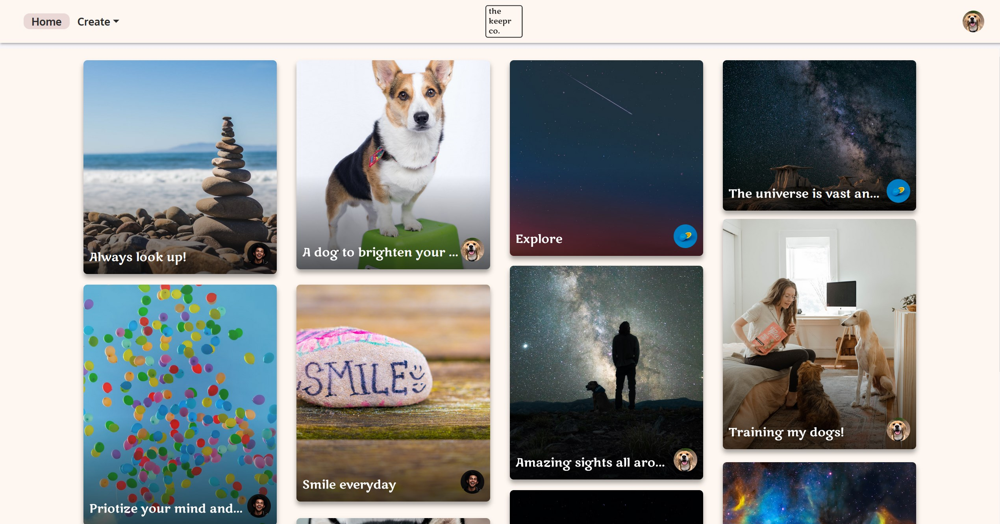

 

# Keepr

[Keepr Live Demo](https://keepr.arringtonm.com/)

## Summary

Keepr is a Pinterest style full-stack web-application, with the ability to share pictures with captions to everyone on the site. Users can then save these images into their own collections called vaults. Vaults can be made public or private by the user, if private, other users can not view that vault.

## Technologies Used

- VueJS for the Frontend Javascript Framework
- .NET for the Backend C# Framework
- MySQL database hosted on AWS
- Auth0 for user authentication

## What I learned
Through the development of this application, I became familiar with C# and the workflow of the .NET Framework. I also learned how to host a MySQL databse on AWS, and connecting that to the application. Lastly, I was able to further refine my VueJS familiarity and create a very pleasing UI/UX.
